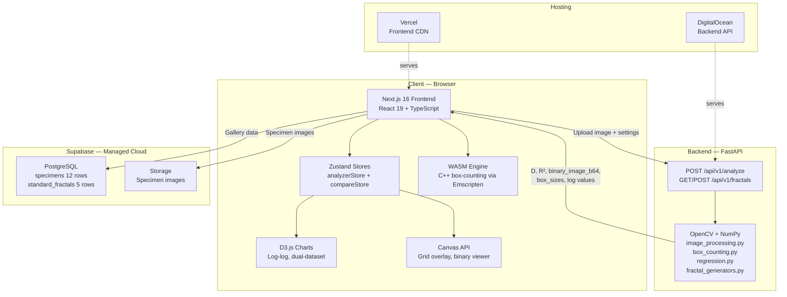

# FractalVision Lab — Implementation Plan (v6 — June 11, 2026)

## Current Project State

| Field | Value |
|-------|-------|
| **Status** | ✅ **Production** — fully deployed and operational |
| **Frontend** | [https://fractalvision-frontend.vercel.app](https://fractalvision-frontend.vercel.app) |
| **Backend API** | [https://fractalvision-backend-jt6d2.ondigitalocean.app](https://fractalvision-backend-jt6d2.ondigitalocean.app) |
| **Last updated** | June 11, 2026 |
| **TypeScript errors** | 0 (`npx tsc --noEmit`) |
| **Backend tests** | 16 passing (`pytest tests/`) |
| **Phases complete** | 0–8, 10, 11 (Phase 9 deliberately skipped) |

---

## 1. Project Overview

**FractalVision Lab** is an interactive web application for estimating the fractal dimension of images using the box-counting method. It was born from a **dissertation project** that analyzed leaf specimens and coastline images. The app turns that academic work into a polished, visual, scientific tool that anyone can use.

### What it does (end-to-end flow):
1. User uploads an image (leaf, coastline, any pattern)
2. Image is preprocessed: grayscale → thresholding (Otsu/adaptive/manual) → binary mask
3. Box-counting algorithm runs across multiple scales (powers of 2)
4. Linear regression on log(1/box_size) vs log(count) yields the **fractal dimension D** and **R² score**
5. Results are visualized with interactive charts, grid overlays, and interpretive labels
6. Users can compare against 12 dissertation specimens stored in Supabase
7. Standard mathematical fractals (Koch, Sierpiński, Cantor) validate the algorithm
8. Client-side WASM benchmark compares JavaScript vs WebAssembly performance

### Who it's for:
- The dissertation committee (academic demo)
- Students/researchers exploring fractal geometry
- Anyone curious about the complexity of natural patterns

### Key constraint:
- **No authentication.** Everything is public and anonymous. Analysis runs are not persisted server-side. Gallery data is read-only from Supabase.

---

## 2. Confirmed Decisions & Overrides

These decisions were locked during Phase 0 scaffolding and override the original v1 plan:

| Decision | Choice | Override from v1? |
|----------|--------|-------------------|
| **Image processing** | `opencv-python-headless` + `numpy` | ✅ Replaced Pillow — OpenCV is industry standard, supports adaptive threshold, Canny, morphological ops |
| **Analysis execution** | Server-side via FastAPI (not client-side) | ✅ Original plan was client-first (TypeScript + Canvas). We moved core analysis to FastAPI for reproducibility and OpenCV access. Client-side WASM exists only for benchmarking (Phase 10) |
| **Local dev** | Python `venv` on Windows, no Docker | ✅ Docker files exist but are unused |
| **Tailwind version** | v4 (installed by Next.js 16 default) | ✅ Plan said v3, but Next.js 16 ships with Tailwind v4 + `@tailwindcss/postcss` |
| **Next.js version** | 16.2.7 (App Router) | ✅ Plan said 14, but we used latest |
| **React version** | 19.2.4 | Newer than planned, no issues |
| **Enum values** | `full_mask` (underscores, not hyphens) | ✅ Standardized snake_case across frontend ↔ backend |
| **Specimen type fields** | snake_case matching Postgres columns | ✅ Originally camelCase in TS; changed to snake_case to avoid mapping |
| **Stack** | Supabase (DB + Storage) + FastAPI (compute) | Same as planned |
| **Authentication** | None (all public) | Same as planned |
| **Repos** | Separate repos: `fractalvision-frontend/` + `fractalvision-backend/` | Same as planned |
| **Frontend deployment** | Vercel (auto-deploy from GitHub main) | ✅ Deployed |
| **Backend deployment** | DigitalOcean App Platform (Bangalore BLR1) | ✅ Changed from Railway/Render to DigitalOcean |

---

## 3. Architecture



### Data flow for single-image analysis:
```
User drops image → ImageUploader.tsx → FormData (file + settings)
  → POST /api/v1/analyze (FastAPI)
    → decode_uploaded_image() → resize_if_needed(1024) → to_grayscale()
    → [threshold routing: otsu | adaptive | manual | boundary | texture]
    → box_counting.run_box_counting() → regression.linear_regression()
    → AnalyzeResponse JSON (D, R², box data, binary_image_b64)
  → Zustand store updates → ResultCard + LogLogChart + PipelineViewer render
```

### Data flow for WASM benchmark:
```
User drops image → loadImageAsBinary() (client-side Otsu)
  → runBoxCountingJs(pixels, w, h)  — timed with performance.now()
  → runBoxCountingWasm(pixels, w, h) — timed with performance.now()
  → BenchmarkChart + metric cards + speedup banner
No server requests. Entirely client-side.
```

---

## 4. Tech Stack (Actual, as built)

### Frontend (`fractalvision-frontend/`)

| Layer | Technology | Version |
|-------|-----------|---------|
| Framework | Next.js (App Router) | 16.2.7 |
| Language | TypeScript (strict) | ^5 |
| UI Library | React | 19.2.4 |
| Styling | Tailwind CSS | v4 |
| State | Zustand | ^5.0.14 |
| Charting | D3.js | ^7.9.0 |
| Animation | Framer Motion | ^12.40.0 |
| DB Client | @supabase/supabase-js | ^2.107.0 |
| PDF Export | jsPDF + html2canvas | ^4.2.1 / ^1.4.1 |
| Analytics | @vercel/analytics | ^2.0.1 |
| WASM Compiler | Emscripten (emcc) | 6.0.0 |

### Backend (`fractalvision-backend/`)

| Layer | Technology |
|-------|-----------|
| Framework | FastAPI |
| Language | Python 3.14 |
| Image Processing | opencv-python-headless |
| Math | numpy, scipy |
| Rate Limiting | slowapi |
| Config | pydantic-settings, python-dotenv |
| ASGI Server | uvicorn[standard] |
| HTTP Client | httpx, requests |
| DB Client | supabase |
| Testing | pytest |

### Infrastructure

| Service | Purpose | Status |
|---------|---------|--------|
| Supabase | PostgreSQL database + Storage (managed cloud, free tier) | ✅ Active |
| GitHub | Version control — both repos pushed to `M3hul-raj` | ✅ Active |
| Vercel | Frontend deployment (auto-deploy on push to main) | ✅ Active |
| DigitalOcean App Platform | Backend deployment ($10/mo, 1GB RAM, BLR1 Bangalore) | ✅ Active |

---

## 5. Deployment Configuration

### Frontend — Vercel

| Setting | Value |
|---------|-------|
| Platform | Vercel (free tier) |
| Deploy trigger | GitHub auto-deploy on push to `main` |
| Build command | `next build` (Vercel default) |
| Output directory | `.next` (Vercel default) |

**Environment variables:**

| Variable | Purpose |
|----------|---------|
| `NEXT_PUBLIC_SUPABASE_URL` | Supabase project URL |
| `NEXT_PUBLIC_SUPABASE_ANON_KEY` | Supabase anonymous key (public, read-only) |
| `NEXT_PUBLIC_API_URL` | Backend API base URL (`https://fractalvision-backend-jt6d2.ondigitalocean.app/api/v1`) |

### Backend — DigitalOcean App Platform

| Setting | Value |
|---------|-------|
| Platform | DigitalOcean App Platform |
| Plan | Basic ($10/month, 1 GB RAM) |
| Region | Bangalore (BLR1) |
| Buildpack | Python (not Docker) |
| Start command | `uvicorn app.main:app --host 0.0.0.0 --port $PORT` |
| Credit | $200 from GitHub Student Developer Pack (expires June 2027) |

**Environment variables:**

| Variable | Purpose |
|----------|---------|
| `SUPABASE_URL` | Supabase project URL |
| `SUPABASE_SERVICE_KEY` | Supabase service role key (server-side only) |
| `ALLOWED_ORIGINS` | CORS origins (comma-separated: Vercel URL + localhost) |

---

## 6. GitHub Repositories

| Repo | URL |
|------|-----|
| **Frontend** | `github.com/M3hul-raj/fractalvision-frontend` |
| **Backend** | `github.com/M3hul-raj/fractalvision-backend` |

---

## 7. Database Schema (Supabase PostgreSQL)

Two read-only tables, pre-seeded. SQL migration lives at `c:\Users\mehul\Fractal Project\supabase_migration.sql`.

### `specimens` table (12 rows: 7 leaves + 5 coastlines)

```sql
CREATE TABLE specimens (
    id                       TEXT PRIMARY KEY,         -- e.g. 'spc_guava'
    name                     TEXT NOT NULL,
    category                 TEXT NOT NULL CHECK (category IN ('leaf', 'coastline', 'standard-fractal')),
    description              TEXT,
    image_url                TEXT NOT NULL DEFAULT '',
    binary_image_url         TEXT DEFAULT '',
    fractal_dimension        DOUBLE PRECISION NOT NULL,
    r_squared                DOUBLE PRECISION NOT NULL,
    intercept                DOUBLE PRECISION,
    standard_error           DOUBLE PRECISION,
    confidence_interval_low  DOUBLE PRECISION,
    confidence_interval_high DOUBLE PRECISION,
    complexity_class         TEXT,                     -- 'High', 'Complex', 'Near space-filling', etc.
    interpretation           TEXT NOT NULL,
    notes                    TEXT,
    box_sizes                INTEGER[] NOT NULL DEFAULT '{}',
    box_counts               INTEGER[] NOT NULL DEFAULT '{}',
    log_inverse_sizes        DOUBLE PRECISION[] DEFAULT '{}',
    log_counts               DOUBLE PRECISION[] DEFAULT '{}',
    display_order            INTEGER DEFAULT 0,
    created_at               TIMESTAMPTZ DEFAULT NOW()
);
```

### `standard_fractals` table (5 rows)

| id | name | theoretical_dimension |
|----|------|----------------------|
| cantor_set | Cantor Set | 0.6309 |
| koch_curve | Koch Curve | 1.2619 |
| koch_snowflake | Koch Snowflake | 1.2619 |
| sierpinski_triangle | Sierpiński Triangle | 1.5850 |
| sierpinski_carpet | Sierpiński Carpet | 1.8928 |

### Seeded specimen data

| ID | Name | Category | D | R² | Complexity |
|----|------|----------|---|-----|------------|
| spc_guava | Guava | leaf | 1.8110 | 0.9976 | High |
| spc_lamiaceae | Lamiaceae | leaf | 1.9493 | 0.9999 | Near space-filling |
| spc_mango | Mango | leaf | 1.7599 | 0.9953 | Complex |
| spc_monoon | Monoon Longifolium | leaf | 1.7505 | 0.9961 | Complex |
| spc_peepal | Peepal | leaf | 1.8043 | 0.9977 | High |
| spc_maple | Maple | leaf | 1.5061 | 0.9815 | Complex |
| spc_akondo | Akondo | leaf | 1.8727 | 0.9988 | High |
| spc_coast1 | Coastline 1 | coastline | 1.7613 | 0.9991 | Complex |
| spc_coast2 | Coastline 2 | coastline | 1.9141 | 0.9999 | Highly irregular |
| spc_coast3 | Coastline 3 | coastline | 1.9626 | 1.0000 | Near space-filling |
| spc_coast4 | Coastline 4 | coastline | 1.7108 | 0.9996 | Complex |
| spc_coast5 | Coastline 5 | coastline | 1.9531 | 1.0000 | Highly irregular |

---

## 8. API Surface

### FastAPI Endpoints (Backend)

| Method | Endpoint | Status | Description |
|--------|----------|--------|-------------|
| `POST` | `/api/v1/analyze` | ✅ Working | Single image → D, R², binary image, box data |
| `POST` | `/api/v1/analyze/batch` | 🔲 Stub | Batch analysis (multiple images) — intentionally excluded |
| `GET` | `/api/v1/fractals` | ✅ Working | List 5 standard fractal types |
| `POST` | `/api/v1/fractals/{id}/generate` | ✅ Working | Generate fractal image at N iterations, run box-counting, return computed D vs theoretical D |
| `GET` | `/api/v1/meta/interpretation-bands` | 🔲 Stub | D-value interpretation bands — intentionally excluded |
| `GET` | `/api/v1/health` | ✅ Working | Health check |

### `/api/v1/analyze` — Full Request/Response

**Request:** `multipart/form-data`

| Field | Type | Default | Description |
|-------|------|---------|-------------|
| `file` | binary | required | Image file (PNG, JPG, WEBP). Max 10 MB |
| `analysis_mode` | string | `full_mask` | `full_mask`, `boundary`, `texture` |
| `threshold_method` | string | `otsu` | `otsu`, `manual`, `adaptive` |
| `threshold_value` | integer | `128` | 0–255 (used when `threshold_method=manual`) |
| `invert` | boolean | `false` | Invert foreground/background |
| `denoise` | boolean | `false` | Apply denoising (stub) |
| `blur_level` | integer | `0` | Gaussian blur kernel (stub) |
| `grid_offsets` | string | `"0,0.25,0.5,0.75"` | Comma-separated fractions |
| `run_sensitivity` | boolean | `false` | Run threshold sensitivity test |

**Response:** `AnalyzeResponse` includes:
- `parameters` — settings used (mode, threshold, image dimensions)
- `result` — D, R², intercept, standard_error, box_sizes, box_counts, log arrays, fitted_values, residuals, foreground_ratio, quality_score, reliability, interpretation, complexity_class, warnings
- `binary_image_b64` — base64-encoded PNG of the binary image
- `sensitivity` — `SensitivityResult | null` (thresholds_tested, dimensions, std_deviation, is_stable)
- `processing_time_ms`
- `threshold_method`, `threshold_value`, `analysis_mode` — echo back for UI display

### `/api/v1/fractals/{id}/generate` — Request/Response

**Request:** JSON body (`GenerateFractalRequest`)

| Field | Type | Default | Description |
|-------|------|---------|-------------|
| `iterations` | integer | required | Recursion depth (clamped to per-fractal max) |
| `image_size` | integer | `1024` | Output image dimensions (square) |
| `box_sizes` | list[int] | `[]` | Custom box sizes (empty = auto-select) |

**Response:** `GenerateFractalResponse`
- `fractal_id`, `name`, `iterations`
- `theoretical_dimension`, `computed_dimension`, `error_percentage`
- `r_squared`
- `image_base64` — base64-encoded PNG of the generated fractal
- `box_sizes`, `box_counts`, `log_inverse_sizes`, `log_counts`
- `processing_time_ms`

### Supabase Direct Queries (Frontend)

| Query | Status | Description |
|-------|--------|-------------|
| `getSpecimens()` | ✅ Implemented | All specimens, ordered by D desc |
| `getSpecimensByType(type)` | ✅ Implemented | Filter by 'leaf' or 'coastline' |
| `getSpecimenById(id)` | ✅ Implemented | Single specimen lookup |
| `getStandardFractals()` | ✅ Implemented | All 5 standard fractals |

---

## 9. File Structure

### Frontend (`fractalvision-frontend/`)

```
src/
├── app/                              # Next.js App Router pages
│   ├── layout.tsx                    # ✅ Root layout — Navbar, Footer, Analytics, SEO metadata
│   ├── globals.css                   # ✅ Global styles (Tailwind v4)
│   ├── page.tsx                      # ✅ Landing page (hero, stats, features, tech stack, CTA)
│   ├── lab/page.tsx                  # ✅ Analyzer Lab (main product page)
│   ├── gallery/page.tsx              # ✅ Specimen Gallery (filter, sort, cards)
│   ├── compare/page.tsx              # ✅ Compare Mode (dual upload/specimen slots)
│   ├── explorer/page.tsx             # ✅ Fractal Explorer (generator + lightbox + results table)
│   ├── benchmarks/page.tsx           # ✅ WASM Benchmark (JS vs WASM performance comparison)
│   ├── methodology/page.tsx          # ✅ Methodology (5 academic sections with SEO metadata)
│   └── limitations/page.tsx          # ✅ Scientific Limitations (5 sections, amber accent)
│
├── components/
│   ├── layout/
│   │   ├── Navbar.tsx                # ✅ 8 links + mobile hamburger (scrollable dropdown)
│   │   ├── Footer.tsx                # ✅ Footer
│   │   └── PageShell.tsx             # ✅ Page wrapper (max-w-7xl, padding)
│   ├── analyzer/
│   │   ├── ImageUploader.tsx          # ✅ Dumb component (props: onFileDrop, isAnalyzing, error)
│   │   ├── PreprocessingControls.tsx   # ✅ Mode/threshold/slider controls + sensitivity toggle
│   │   ├── ResultCard.tsx             # ✅ D + R² display with ReportButton
│   │   ├── ReportButton.tsx           # ✅ PDF export trigger (reads analyzerStore)
│   │   ├── PipelineViewer.tsx         # ✅ Binary image + grid overlay canvas
│   │   ├── BoxSizeSlider.tsx          # ✅ Box-size scale selector
│   │   ├── GridOverlay.tsx            # ✅ Canvas grid rendering
│   │   ├── QualityScore.tsx           # ✅ SVG arc gauge + reliability badge + precision + sparkline
│   │   ├── AnalysisModeSelector.tsx   # 🔲 Stub (superseded by PreprocessingControls)
│   │   ├── ThresholdControls.tsx      # 🔲 Stub (superseded by PreprocessingControls)
│   │   └── BinaryCanvas.tsx           # 🔲 Stub
│   ├── benchmarks/
│   │   └── BenchmarkChart.tsx         # ✅ SVG horizontal bar chart (sky-400 / orange-400)
│   ├── charts/
│   │   ├── LogLogChart.tsx            # ✅ D3.js scatter + regression + dual-dataset amber overlay
│   │   ├── BenchmarkChart.tsx         # 🔲 Stub (orphaned — real one is benchmarks/BenchmarkChart)
│   │   ├── ResidualChart.tsx          # 🔲 Stub
│   │   └── SensitivityChart.tsx       # 🔲 Stub
│   ├── compare/
│   │   ├── ComparePanel.tsx           # ✅ Upload vs Gallery segmented control per slot
│   │   ├── CompareResults.tsx         # ✅ 4 metric cards, D-value bars, conclusion text
│   │   ├── DualLogLogChart.tsx        # ✅ D3, shared axes, HTML legend
│   │   ├── ComparisonPanel.tsx        # ✅ Specimen comparison in /lab page
│   │   └── SpecimenPickerModal.tsx    # ✅ Modal to select comparison specimen in /lab
│   ├── explorer/
│   │   ├── ExplorerLogLogChart.tsx     # ✅ Prop-based D3 chart (decoupled from Zustand)
│   │   ├── CantorSet.tsx              # 🔲 Stub (rendering is server-side)
│   │   ├── KochCurve.tsx              # 🔲 Stub
│   │   ├── SierpinskiTriangle.tsx     # 🔲 Stub
│   │   └── SierpinskiCarpet.tsx       # 🔲 Stub
│   └── gallery/
│       ├── SpecimenCard.tsx           # ✅ Gallery card with badges, hover effects
│       ├── GalleryGrid.tsx            # 🔲 Stub (grid is inline in page.tsx)
│       └── SpecimenDetail.tsx         # 🔲 Stub
│
├── hooks/
│   └── useAutoAnalyze.ts             # ✅ Auto re-analyze on settings change (600ms debounce)
│
├── store/
│   ├── analyzerStore.ts              # ✅ Zustand — file, result, settings, error, lastResponse, runSensitivity
│   └── compareStore.ts               # ✅ Zustand — two slots (A+B), generic setSlotField setter
│
├── lib/
│   ├── api/client.ts                 # ✅ analyzeImage(), generateFractal(), listFractals()
│   ├── supabase/
│   │   ├── client.ts                 # ✅ Supabase JS client
│   │   └── queries.ts                # ✅ getSpecimens, getSpecimensByType, getSpecimenById, getStandardFractals
│   ├── data/
│   │   ├── dissertationResults.ts    # ✅ Static fallback data (snake_case)
│   │   ├── standardFractals.ts       # ✅ Static fractal reference data (snake_case)
│   │   └── interpretationBands.ts    # ✅ D-value interpretation bands
│   ├── report/
│   │   └── generateReport.ts         # ✅ jsPDF + SVG serializer. 2-page PDF
│   ├── wasm/
│   │   ├── imageProcessor.ts         # ✅ loadImageAsBinary(): File → resize → grayscale → Otsu → binary
│   │   ├── boxCountingJs.ts          # ✅ Pure TS box-counting. Exports JsAnalysisResult + runBoxCountingJs()
│   │   └── boxCountingWasm.ts        # ✅ Singleton WASM loader + runBoxCountingWasm()
│   ├── fractal/                      # 🔲 Stubs (not needed — server handles this)
│   └── image/                        # 🔲 Stubs (not needed except WASM benchmark uses imageProcessor.ts)
│
└── types/
    ├── analysis.ts                   # ✅ AnalysisResult, ProcessingState, SensitivityResult, QualityComponents
    ├── specimen.ts                   # ✅ Specimen, StandardFractal types (snake_case)
    └── api.ts                        # ✅ AnalyzeApiResponse, GenerateFractalResponse, StandardFractalInfo

wasm/                                 # C++ source files (NOT in src/)
├── box_counting.cpp                  # ✅ C++ box-counting + OLS regression
├── compile.bat                       # ✅ Windows build script
└── compile.sh                        # ✅ Unix/Mac build script

public/wasm/                          # Compiled WASM output (committed to git)
├── box_counting.js                   # ✅ Emscripten glue code (14 KB)
└── box_counting.wasm                 # ✅ Compiled WebAssembly binary (142 KB)
```

### Backend (`fractalvision-backend/`)

```
app/
├── main.py                           # ✅ FastAPI app + CORS middleware
├── config.py                         # ✅ Pydantic Settings (env vars)
├── __init__.py
│
├── api/v1/
│   ├── router.py                     # ✅ v1 router aggregator
│   ├── analyze.py                    # ✅ POST /analyze (working), POST /analyze/batch (stub). 10MB/JPG/PNG/WEBP validation
│   ├── fractals.py                   # ✅ GET /fractals (list), POST /fractals/{id}/generate (generate+analyze)
│   ├── meta.py                       # 🔲 Stub (interpretation bands)
│   └── health.py                     # ✅ GET /health
│
├── core/
│   ├── image_processing.py           # ✅ decode, resize, grayscale, otsu, manual, adaptive, boundary, texture, encode_base64
│   ├── box_counting.py               # ✅ auto_select_box_sizes, box_count, box_count_with_offsets, run_box_counting
│   ├── regression.py                 # ✅ linear_regression (scipy.stats.linregress), compute_log_values, compute_r_squared
│   ├── fractal_generators.py         # ✅ 5 generators: Cantor, Koch Curve, Koch Snowflake, Sierpiński Triangle, Sierpiński Carpet
│   ├── quality_score.py              # ✅ calculate_quality_score(r_squared, num_scales)
│   ├── sensitivity.py                # ✅ run_threshold_sensitivity(): threshold ± 15, σ < 0.05 = stable
│   └── interpretation.py             # ✅ D-value interpretation and complexity classification
│
├── models/
│   ├── enums.py                      # ✅ AnalysisMode, ThresholdMethod, Reliability, ComplexityClass
│   ├── requests.py                   # ✅ GenerateFractalRequest
│   └── responses.py                  # ✅ AnalyzeResponse, GenerateFractalResponse, StandardFractalInfo, SensitivityResult
│
└── utils/
    ├── rate_limiter.py               # ✅ IP-based rate limiter (slowapi)
    ├── image_validation.py           # 🔲 Stub (validation inline in analyze.py)
    └── id_generator.py               # 🔲 Stub

tests/
├── test_image_processing.py          # ✅ 7 tests
├── test_box_counting.py              # ✅ 3 tests
├── test_regression.py                # ✅ 2 tests
├── test_quality_score.py             # ✅ 2 tests
├── test_sensitivity.py               # ✅ 2 tests
├── test_analyze_endpoint.py          # 🔲 Stub
└── conftest.py                       # ✅ pytest config
```

---

## 10. Core Algorithm (as implemented)

This is the exact math pipeline in `app/core/`:

### Step 1: Image Preprocessing (`image_processing.py`)
```python
image = decode_uploaded_image(file_bytes)    # cv2.imdecode from raw bytes
image = resize_if_needed(image, 1024)        # Scale to max 1024px dimension
grayscale = to_grayscale(image)              # cv2.cvtColor BGR→GRAY
```

### Step 2: Binary Conversion (5 modes)
| Mode | Function | Method |
|------|----------|--------|
| `full_mask` + `otsu` | `otsu_threshold(gray)` | `cv2.THRESH_BINARY_INV + cv2.THRESH_OTSU` |
| `full_mask` + `manual` | `manual_threshold(gray, value)` | `cv2.threshold(gray, value, 255, cv2.THRESH_BINARY_INV)` |
| `full_mask` + `adaptive` | `adaptive_threshold(gray)` | `cv2.adaptiveThreshold(GAUSSIAN_C, block=11, C=2)` |
| `boundary` | `mode_boundary(gray)` | Otsu → `cv2.Canny(binary, 50, 150)` |
| `texture` | `mode_texture(gray)` | Morphological gradient → Otsu |

> [!IMPORTANT]
> All threshold functions return tuples: `(binary_image, threshold_value_or_None)`. This is an architectural invariant — all callers in `analyze.py` and tests must destructure accordingly.

### Step 3: Box Counting (`box_counting.py`)
```python
box_sizes = auto_select_box_sizes(width, height)  # Powers of 2: 4 → min(w,h)//4
counts = run_box_counting(binary, w, h, box_sizes, offsets=[0, 0.25, 0.5, 0.75])
# For each box_size and each offset: count non-empty boxes, take minimum across offsets
```

### Step 4: Regression (`regression.py`)
```python
x = -np.log(box_sizes)              # log(1/size) — equivalent to log(1/ε)
y = np.log(box_counts)              # log(count)
result = scipy.stats.linregress(x, y)
# slope = fractal dimension D
# R² = rvalue ** 2
# Validation: if D is NaN, inf, <0.5, or >2.1 → raise ValueError (HTTP 422)
```

### Step 5: Quality & Sensitivity
```python
# Quality score (0-100):
score = round(R² × 80) + clamp(scales - 3, 0, 5) × 4  # capped at 100
# Reliability: ≥85 = High, ≥70 = Medium, <70 = Low

# Sensitivity test (optional, full_mask + non-adaptive only):
# Re-runs analysis at threshold, threshold-15, threshold+15
# σ < 0.05 → Stable; σ ≥ 0.05 → Unstable
```

---

## 11. WASM Build System

### Overview

Phase 10 implemented a client-side box-counting engine in C++, compiled to WebAssembly via Emscripten 6.0.0. This exists exclusively for the `/benchmarks` page — it does **not** replace the server-side FastAPI analysis pipeline.

### Source and output locations

| File | Location | Size |
|------|----------|------|
| C++ source | `wasm/box_counting.cpp` | 8.6 KB |
| Windows build script | `wasm/compile.bat` | 456 B |
| Unix build script | `wasm/compile.sh` | 526 B |
| Compiled JS glue | `public/wasm/box_counting.js` | ~14 KB |
| Compiled WASM binary | `public/wasm/box_counting.wasm` | ~142 KB |

### Compile command (Windows)

```batch
emcc wasm/box_counting.cpp ^
  -o public/wasm/box_counting.js ^
  -s WASM=1 ^
  -s MODULARIZE=1 ^
  -s EXPORT_NAME="createBoxCountingModule" ^
  -s EXPORTED_FUNCTIONS="['_wasm_run_analysis','_wasm_free','_malloc','_free']" ^
  -s EXPORTED_RUNTIME_METHODS="['UTF8ToString','HEAPU8']" ^
  -s ALLOW_MEMORY_GROWTH=1 ^
  -s ENVIRONMENT="web" ^
  -s SINGLE_FILE=0 ^
  -O2 ^
  --no-entry
```

### Why compiled files are committed to git

Vercel's build environment does **not** include Emscripten. The compiled `.js` and `.wasm` files must be committed to the repository so Vercel can serve them as static assets from `public/wasm/`. They are not gitignored.

### WASM cold start behavior

The first benchmark run on a fresh page load includes WASM module initialization (~200ms). This is because:
1. The `<script>` tag for `box_counting.js` is injected lazily on first call
2. `createBoxCountingModule()` compiles and instantiates the WASM binary
3. The module is cached in a singleton (`_module` variable in `boxCountingWasm.ts`)

Subsequent runs reuse the cached module and typically complete in ~1ms.

### C++ algorithm details

The C++ implementation mirrors the Python backend exactly:
- `auto_select_box_sizes(w, h)` — powers of 2 from 4 to `min(w,h)/4`
- `box_count(pixels, w, h, box_size)` — count boxes with any pixel == 255 (no grid offsets — simplified for benchmarking)
- `run_box_counting(pixels, w, h)` — iterates all box sizes, computes `log(1/bs)` as `-log(bs)`, guards `log(0)` with `max(c, 1)`
- `compute_fractal_dimension(json)` — hand-rolled OLS: slope, intercept, R² from standard formulas
- `wasm_run_analysis()` — combines both into a single JSON string, allocated with `malloc`
- `wasm_free()` — frees the returned pointer

JSON is built manually with `std::ostringstream` — no external JSON libraries.

---

## 12. Phase Progress

### ✅ Phase 0: Scaffolding (COMPLETE)
- Both repos initialized with full folder structure
- Supabase project created, DB migrated, 12 specimens + 5 fractals seeded
- FastAPI with CORS, rate limiter, health endpoint
- Next.js with App Router, all route stubs, Navbar, Zustand store, Supabase client
- Git initialized, pushed to GitHub

### ✅ Phase 1: Foundation MVP (COMPLETE)
- Backend: `image_processing.py`, `box_counting.py`, `regression.py` — full OpenCV pipeline
- Backend: `POST /api/v1/analyze` endpoint returning `AnalyzeResponse`
- Backend: 12 pytest tests passing (box_counting, image_processing, regression)
- Frontend: `/lab` page with drag-and-drop `ImageUploader`, `ResultCard` (D + R²), D3.js `LogLogChart`
- Full end-to-end: upload image → see fractal dimension + log-log plot

### ✅ Phase 2: Interactive Visualization — Algorithm Microscope (COMPLETE)
- Backend: `binary_image_b64` field added to `AnalyzeResponse` (base64 PNG of binary image)
- Frontend: `PipelineViewer` — renders binary image on canvas with grid overlay
- Frontend: `BoxSizeSlider` — select a box size, see the grid change on the canvas
- Frontend: `GridOverlay` — draws the counting grid at the selected scale
- Frontend: D3.js chart highlights the data point matching the selected box size

### ✅ Phase 3: Advanced Preprocessing Controls (COMPLETE)
- Backend: Added `manual_threshold()`, `adaptive_threshold()`, `mode_boundary()` (Canny), `mode_texture()` (morphological gradient)
- Backend: `AnalysisMode` enum updated: `full_mask`, `boundary`, `texture`
- Backend: Degenerate result validation (D outside 0.5–2.1 → HTTP 422)
- Frontend: `PreprocessingControls.tsx` — radio buttons for mode + threshold, slider for manual value
- Frontend: `useAutoAnalyze.ts` hook — auto re-runs analysis when settings change (600ms debounce for slider)
- Frontend: Error state in Zustand store + error display in upload zone
- 4 new backend tests (manual, adaptive, boundary, texture)

### ✅ Phase 4: Specimen Gallery (COMPLETE)
- Fixed `.env.local` Supabase URL (removed `/rest/v1/` suffix)
- Updated `Specimen` type and all TypeScript interfaces to strict `snake_case` matching Postgres columns
- Implemented `queries.ts` — `getSpecimens()`, `getSpecimensByType()`, `getSpecimenById()`, `getStandardFractals()`
- Built gallery page with filter bar (All/Leaves/Coastlines), sort dropdown, loading skeletons, error/empty states
- Built `SpecimenCard.tsx` with type badges, complexity class, D/R² hero numbers, and specimen image rendering
- Python script (`upload_images.py`) uploaded all dissertation images to Supabase Storage

### ✅ Phase 5: Reliability Dashboard (COMPLETE)

**Backend:**
- `image_processing.py` — all threshold functions return `(binary, threshold_value)` tuples
- `regression.py` — switched to `scipy.stats.linregress`; added `confidence_interval` (95%) and `standard_error`
- `quality_score.py` — `calculate_quality_score(r_squared, num_scales)` → `{score, reliability}` (0–100 scale)
- `sensitivity.py` — `run_threshold_sensitivity()`: threshold ± 15, σ < 0.05 = stable; returns `None` for adaptive
- 4 new tests: `test_quality_score.py` × 2, `test_sensitivity.py` × 2. **Total: 16 tests passing**

**Frontend:**
- Circular import bug fixed: `SensitivityResult` moved from `api.ts` → `analysis.ts`
- `PreprocessingControls.tsx` — sensitivity toggle, disabled when `analysisMode !== full_mask` OR `thresholdMethod === adaptive`
- `QualityScore.tsx` — SVG semicircular arc gauge, reliability badge, precision panel (D ± margin, CI, SE), sensitivity sparkline with ±0.10 Y-window

### ✅ Phase 5.5: Landing Page & Layout Stabilization (COMPLETE)
- Hero section with gradient headline, dual CTA buttons
- Stats row — 4 stats + decorative SVG log-log chart in flex row
- "From Image to Fractal Dimension in 4 Steps" — Framer Motion scroll-triggered pipeline cards
- "Built for Scientific Rigour" — 4 feature cards in 2×2 grid
- "Built With" — tech stack tags + data flow architecture diagram
- Mobile menu scroll fix: `max-h-[85vh] overflow-y-auto pb-10`
- SVG chart breakpoint at `lg:block` (1024px)

### ✅ Phase 6: Compare Mode (COMPLETE)
- `src/store/compareStore.ts` — isolated Zustand store, two fully independent slots (A+B) with generic `setSlotField` setter
- `src/app/compare/page.tsx` — `lg:grid-cols-2` layout, contextual empty state per slot
- `src/components/compare/ComparePanel.tsx` — Upload vs Gallery segmented control, full preprocessing controls per slot
- `src/components/compare/DualLogLogChart.tsx` — D3, shared axes, HTML legend
- `src/components/compare/CompareResults.tsx` — 4 metric cards, D-value comparison bars, conclusion text
- `ImageUploader.tsx` refactored to dumb component (props: `onFileDrop`, `isAnalyzing`, `error`; no store imports)
- Specimen comparison in `/lab`: `SpecimenPickerModal.tsx`, `ComparisonPanel.tsx`, LogLogChart updated with dual-dataset amber overlay
- Accent colors: Slot A = sky-400 (#38bdf8), Slot B = orange-400 (#fb923c)

### ✅ Phase 7: Fractal Explorer (COMPLETE)

**Backend:**
- `fractal_generators.py` — all 5 generators with FRACTAL_DISPATCH registry:
  - **Cantor Set** (D≈0.6309): draws final iteration segments only (not stacked), max 8 iterations
  - **Koch Curve** (D≈1.2619): recursive segment subdivision with 60° apex, max 7 iterations
  - **Koch Snowflake** (D≈1.2619): three Koch curves from equilateral triangle vertices, max 7 iterations
  - **Sierpiński Triangle** (D≈1.5850): fill-then-erase via `cv2.fillPoly`, queue-based iteration, max 8 iterations
  - **Sierpiński Carpet** (D≈1.8928): 3^N array via numpy slicing, centered on canvas, max 6 iterations
- `fractals.py` — `GET /fractals` (list all) + `POST /fractals/{id}/generate` (generate + box-count + regress)
- `requests.py` — `GenerateFractalRequest` Pydantic model
- `responses.py` — `GenerateFractalResponse`, `StandardFractalInfo` Pydantic models

**Frontend:**
- `src/types/api.ts` — `GenerateFractalResponse`, `StandardFractalInfo` types
- `src/lib/api/client.ts` — `generateFractal()`, `listFractals()` functions
- `src/components/explorer/ExplorerLogLogChart.tsx` — prop-based D3 chart, fully decoupled from Zustand
- `src/app/explorer/page.tsx` — fractal selector cards (5 cards, responsive grid), iteration slider with per-fractal max clamping, auto-generate on mount + change, results table (theoretical vs computed D, error%), Google Maps-style lightbox with:
  - Cursor-focal wheel zoom (`transformOrigin: '0px 0px'` + affine math)
  - Drag-to-pan (mouse + touch)
  - Non-passive `wheel` event listeners (prevents page scroll in lightbox)
  - Pixelated rendering at zoom ≥ 2x (`imageRendering: pixelated`)
  - RAF-based auto-centering at 50% default zoom

### ✅ Phase 8: Report Export (COMPLETE)
- `src/lib/report/generateReport.ts` — async function using jsPDF + SVG serializer (not html2canvas for chart):
  - **Page 1:** Dark banner with key stats, original + binary images in card, 4 metrics (D, R², quality, reliability), parameters card, interpretation + complexity badge, statistical summary (SE, CI, foreground ratio), warnings
  - **Page 2:** Dark banner, D3 SVG captured via `XMLSerializer` → high-DPI PNG (2× canvas), sensitivity analysis card (or "unavailable" hint)
  - Saves as: `FractalVision_Report_{timestamp}.pdf`
- `src/components/analyzer/ReportButton.tsx` — client component, reads `analyzerStore`, renders in top-right of `ResultCard` header

### ✅ Phase 9: Web Workers (DELIBERATELY SKIPPED)
**Reason:** All analysis runs server-side on FastAPI. There is no heavy client-side computation to offload to a Web Worker. The only client-side computation is in the WASM benchmark page, which runs synchronously for accurate timing comparisons. This phase is not applicable to the current architecture.

### ✅ Phase 10: WASM Benchmark Engine (COMPLETE)
- `wasm/box_counting.cpp` — C++ box-counting + hand-rolled OLS regression, mirrors Python backend. Exports: `wasm_run_analysis`, `wasm_free`
- `wasm/compile.bat` + `wasm/compile.sh` — Emscripten build scripts (MODULARIZE=1, -O2, ALLOW_MEMORY_GROWTH=1)
- `public/wasm/box_counting.js` (14 KB) + `box_counting.wasm` (142 KB) — compiled and committed to git
- `src/lib/wasm/imageProcessor.ts` — `loadImageAsBinary()`: loads File, caps at 1024px, RGBA→grayscale, Otsu thresholding, returns binary Uint8Array
- `src/lib/wasm/boxCountingJs.ts` — pure TypeScript mirror of C++. Exports `runBoxCountingJs()` + `JsAnalysisResult` interface
- `src/lib/wasm/boxCountingWasm.ts` — singleton WASM loader. Script injection, `createBoxCountingModule({locateFile})`, malloc/HEAPU8.set/free lifecycle
- `src/components/benchmarks/BenchmarkChart.tsx` — SVG horizontal bar chart, sky-400/orange-400, proportional widths, no D3
- `src/app/benchmarks/page.tsx` — drag-and-drop upload, preprocessing state, runs both implementations with `performance.now()`, agreement badge, metric cards, speedup banner, chart, technical note
- Expected behavior: first WASM run ~200ms (cold start), subsequent ~1ms. JS typically 1–3ms. Results match exactly.

### ✅ Phase 11: Deploy + Polish (COMPLETE — 1 item outstanding)

**Completed:**
- File validation in `analyze.py`: 10 MB limit, JPG/PNG/WEBP only
- SEO metadata in `layout.tsx`: `metadataBase`, OpenGraph tags, Twitter card
- `src/app/methodology/page.tsx` — 5 academic sections: fractal dimension theory, box-counting algorithm, log-log regression, preprocessing pipeline, quality metrics. Full SEO metadata.
- `src/app/limitations/page.tsx` — 5 sections with amber accent: rasterization, scale constraints, threshold sensitivity, image quality, method limitations. Caution/Tip boxes, fractal dimension estimator comparison table.
- `README.md` in both repos — complete with endpoints, algorithms, project structure, test coverage, local dev, deployment
- Vercel Analytics: `@vercel/analytics ^2.0.1`, `<Analytics />` in `layout.tsx`
- `/benchmarks` re-added to Navbar after Phase 10
- Frontend deployed to Vercel (auto-deploy from GitHub)
- Backend deployed to DigitalOcean App Platform (BLR1, Python buildpack)
- CORS configured for production URLs

**Outstanding:**
- ⬜ `localStorage` persistence for analysis results (was in Phase 11 plan, never implemented). Results are lost on page refresh — they live only in Zustand stores.

---

## 13. Environment Variables

### Frontend (`.env.local`)
```env
NEXT_PUBLIC_SUPABASE_URL=https://qpjfwazvcqdvrvninmko.supabase.co
NEXT_PUBLIC_SUPABASE_ANON_KEY=eyJ...  (truncated)
NEXT_PUBLIC_API_URL=http://localhost:8000/api/v1
```

> [!NOTE]
> In production (Vercel), `NEXT_PUBLIC_API_URL` is set to `https://fractalvision-backend-jt6d2.ondigitalocean.app/api/v1`.

### Backend (`.env`)
```env
SUPABASE_URL=https://qpjfwazvcqdvrvninmko.supabase.co
SUPABASE_SERVICE_KEY=eyJ...  (truncated)
ALLOWED_ORIGINS=http://localhost:3000,https://fractalvision-frontend.vercel.app
```

---

## 14. Local Development Setup

### Backend
```powershell
cd fractalvision-backend
python -m venv .venv
.venv\Scripts\activate
pip install -r requirements.txt
uvicorn app.main:app --reload --port 8000
```

### Frontend
```powershell
cd fractalvision-frontend
npm install
npm run dev
# → http://localhost:3000
```

### Running Tests
```powershell
# Backend (16 tests passing)
cd fractalvision-backend
.venv\Scripts\activate
pytest tests/

# Frontend (TypeScript check)
cd fractalvision-frontend
npx tsc --noEmit
```

### Compiling WASM (requires Emscripten 6.0.0 in PATH)
```powershell
cd fractalvision-frontend
wasm\compile.bat
# Output: public/wasm/box_counting.js + box_counting.wasm
```

---

## 15. Architectural Invariants

> [!CAUTION]
> These rules are load-bearing. Violating any of them will cause runtime bugs or circular dependency issues.

| # | Invariant | Rationale |
|---|-----------|-----------|
| 1 | **snake_case everywhere** | TypeScript types match Postgres column names exactly. No mapping layer between frontend, backend, or database. |
| 2 | **Import direction: `api.ts` → `analysis.ts` (never reverse)** | `SensitivityResult` lives in `analysis.ts` ONLY. Reversing creates a circular dependency that silently resolves types as `any`. |
| 3 | **`analyzeImage()` unwraps the API envelope** | Returns `AnalyzeApiResponse`. Callers merge sensitivity: `setResult({ ...res.result, sensitivity: res.sensitivity ?? null })`. |
| 4 | **Threshold functions return tuples** | All functions in `image_processing.py` return `(binary_image, threshold_value_or_None)`. Every caller must destructure. |
| 5 | **Sensitivity: full_mask + non-adaptive only** | Backend returns `null` otherwise. UI toggle greyed out for other modes. |
| 6 | **Degenerate validation: D outside [0.5, 2.1] → HTTP 422** | Catches extreme thresholds that make binary image degenerate. |
| 7 | **No auth, no server-side persistence** | Results live in Zustand only. Lost on refresh. Gallery is read-only from Supabase. |
| 8 | **WASM cold start: ~200ms first run** | Module cached in singleton after first call. Subsequent runs ~1ms. |
| 9 | **WASM HEAPU8 read after malloc** | `ALLOW_MEMORY_GROWTH=1` can reallocate the `ArrayBuffer`. Must access `mod.HEAPU8` fresh after `mod._malloc()`. |
| 10 | **Compiled WASM files are committed** | Vercel has no Emscripten. `public/wasm/` must be in the repo. |

---

## 16. Key Design Decisions & Rationale

| Decision | Why |
|----------|-----|
| **Snake_case everywhere** | Supabase returns Postgres columns as-is. Avoids a mapping layer. Same convention on FastAPI side. |
| **Server-side analysis** | OpenCV provides Otsu, adaptive threshold, Canny, morphological ops. Reproducing in TypeScript would be error-prone. |
| **Auto re-analyze on settings change** | No "Re-analyze" button needed. 600ms debounce for slider inputs. |
| **Degenerate result validation** | Catches extreme threshold values producing meaningless regression slopes. |
| **No auth, no persistence** | Simplifies everything. Gallery data is read-only from Supabase. |
| **Compare store is fully isolated** | `compareStore.ts` does NOT import `analyzerStore`. Each slot manages its own state. |
| **ImageUploader is a dumb component** | Refactored in Phase 6 to props-based (`onFileDrop`, `isAnalyzing`, `error`). Reusable in `/lab` and `/compare`. |
| **WASM benchmark is client-only** | No server requests during benchmarking — isolates comparison from network latency. |
| **PDF chart uses SVG serializer** | `XMLSerializer` → `Blob` → `Image` → 2× DPI canvas, not html2canvas. Crisp D3 SVG output. |

---

## 17. Known Issues & Technical Debt

| Issue | Severity | Status |
|-------|----------|--------|
| `localStorage` persistence never implemented | Low | ⬜ Outstanding |
| `POST /analyze/batch` is a stub | Low | 🔲 Intentionally excluded |
| `GET /meta/interpretation-bands` is a stub | Low | 🔲 Intentionally excluded |
| Several component stubs remain (AnalysisModeSelector, etc.) | Low | Harmless — superseded |
| `charts/BenchmarkChart.tsx` is an orphaned stub | Low | Real one is `benchmarks/BenchmarkChart.tsx` |
| WASM first run ~200ms cold start | By design | Module cached after first call |

---

## 18. Navbar Link Order

1. Home (`/`)
2. Analyzer Lab (`/lab`)
3. Gallery (`/gallery`)
4. Compare (`/compare`)
5. Fractal Explorer (`/explorer`)
6. Benchmarks (`/benchmarks`)
7. Methodology (`/methodology`)
8. Limitations (`/limitations`)

---

*Last updated: June 11, 2026 — All phases complete. Project in production.*
